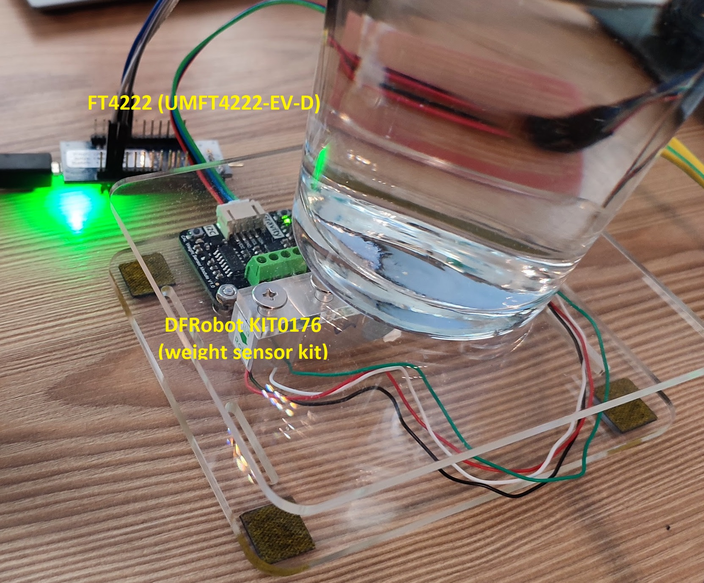
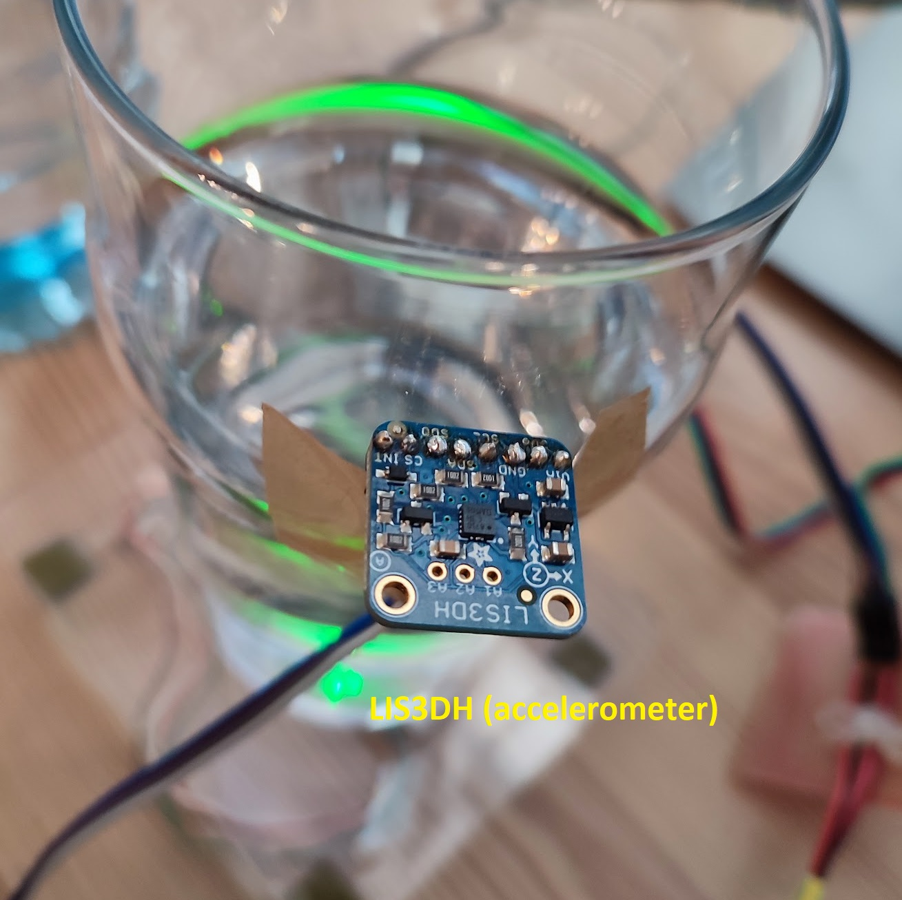
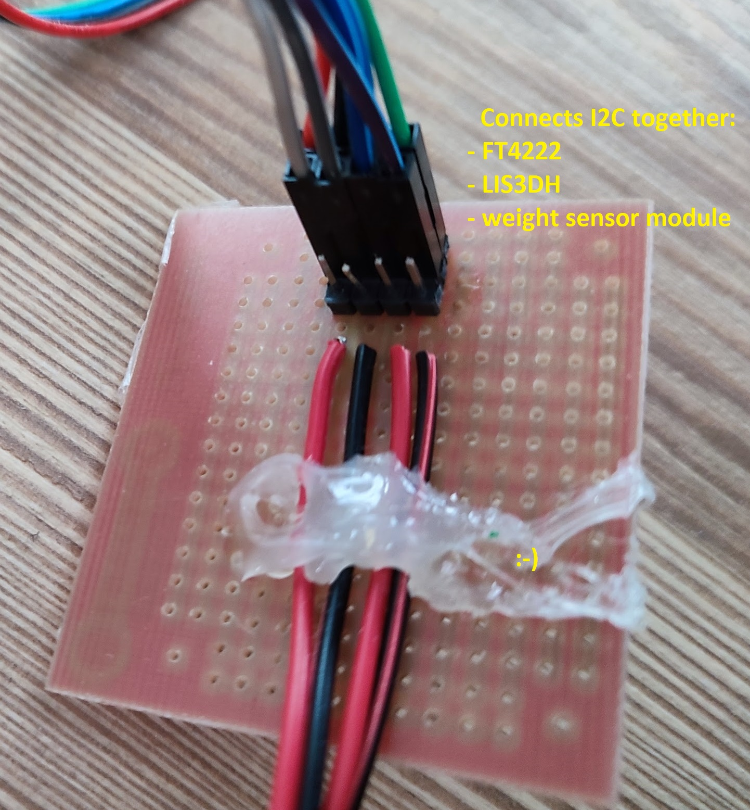

# Samples for training ML model

- Samples contain day, time, weight reading, accelerometer data (1.0 means gravity, whichever dimension has 1 it means it's the most significant one)
- Samples are recorded following way:
  - weight is calibrated that 0 means empty glass
  - start recording when glass is on weight
  - do specific action
  - put glass back on weight
  - some actions may be recorded without lifting glass

# Setup

- Accelerometer: LIS3DH - available on: https://github.com/dotnet/iot/tree/main/src/devices/Lis3Dh (hopefully soon on NuGet)
- Weight: DFRobot KIT0176 (I2C weight sensor kit) - still in PR: https://github.com/dotnet/iot/pull/1956 (hopefully soon on NuGet)
- FT4222 - allows me to use I2C on my Windows machine - https://github.com/dotnet/iot/tree/main/src/devices/Ft4222 - already available in Iot.Device.Bindings NuGet package

# Pictures of the setup

